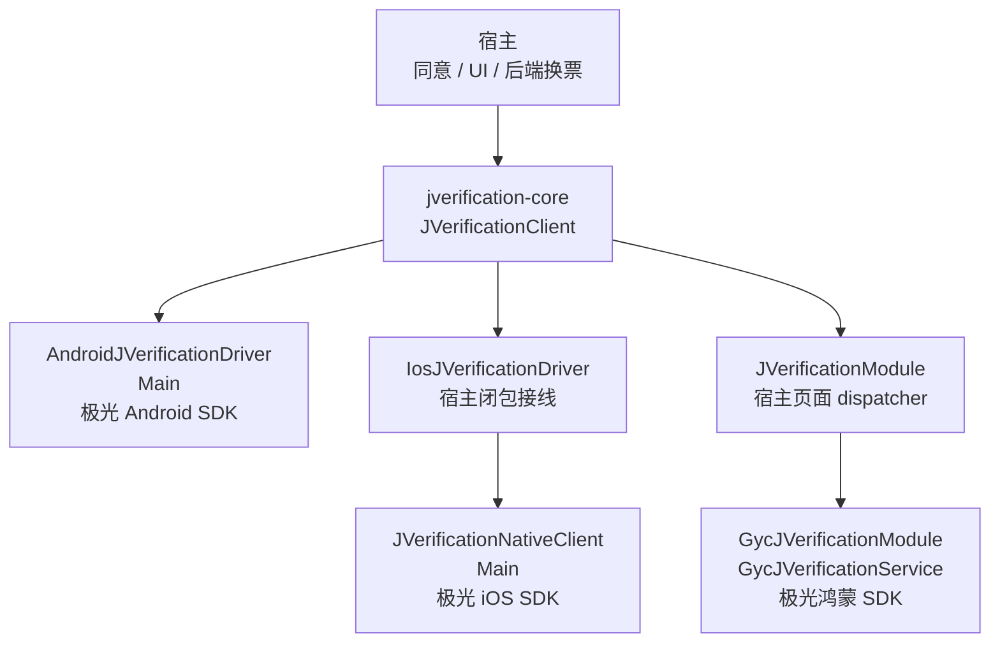
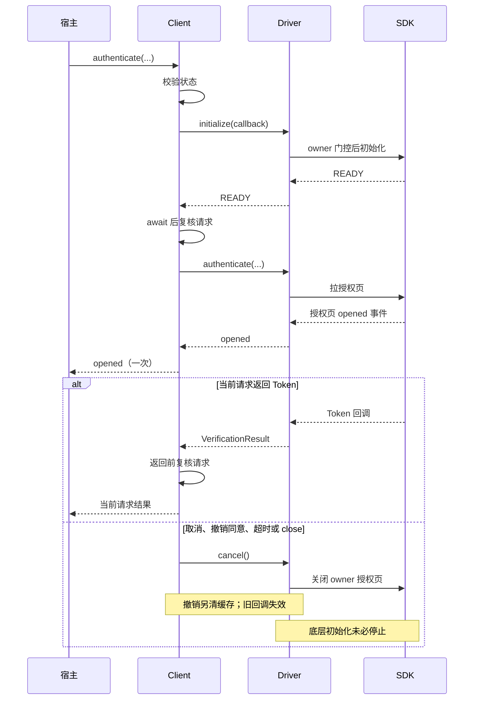
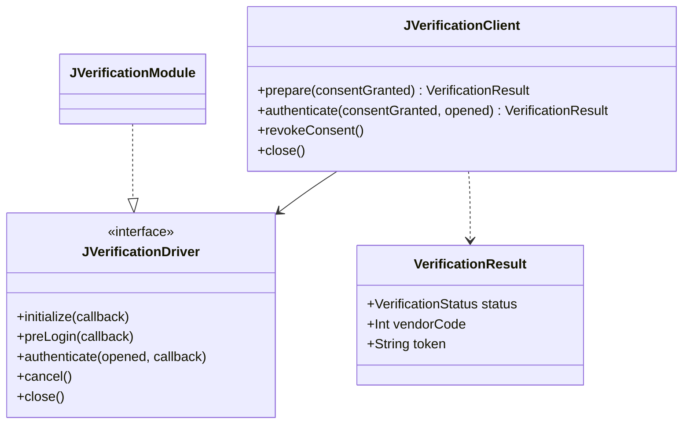

# GY CrossKit JVerification

封装 Android、iOS 和 HarmonyOS 极光一键认证的初始化、预取号、授权 Token 与释放。用户同意、AppKey、应用登记、授权页样式及 Token 后端换票由宿主负责；组件不创建账号、不保存 Token、不返回厂商 SDK content。

当前 Maven 候选 **0.1.2**：统一 `close()` / `dispose()` 的释放入口，避免重复关闭原生授权页；补充取消、迟到回调和重复关闭回归及公共 API 注释，并补齐 Maven 发布元数据校验。**发布准备中，完成远程验收后更新**。iOS Git Pod 继续使用 `0.1.1`（Podspec 内部版本 `0.1.0`），HAR 继续使用 `@gycrosskit/jverification-native@0.1.0`；各渠道分别验收，OHPM Registry 可安装性尚未确认。

## 平台与产物

| 产物 | 平台 / 要求 |
| --- | --- |
| `jverification-core` | Android API 24+ / iOS 15+；共用协程 client、Android driver、iOS 闭包 driver |
| `jverification-kuikly` | OHOS Kotlin Module；Kuikly `2.28.0-2.0.21-ohos` |
| `GycJVerificationNative` | iOS 15+ / Swift 5.9；独立 CocoaPods Git 源，供 Swift 或 KMP driver 使用 |
| `@gycrosskit/jverification-native` | HarmonyOS API 22 兼容 HAR；原生服务及 Kuikly Renderer Module |

KMP 工具链基线为 OpenHarmony Kotlin `2.2.21-1.0.0` / JDK 17 / Gradle 8.11.1 / AGP 8.10.1。Core 的 OHOS / JVM 变体仅提供公共能力，实际 SDK 驱动由 HAR / Kuikly 或宿主实现提供。

厂商版本：Android JVerification `3.4.8` / JCore `5.5.6`，iOS JVerification `3.4.7` / JCore `5.5.1`，HarmonyOS `@jg/verify@1.2.2`。

## 架构与调用流程

KMP client 管理同意、并发与等待；原生适配控制 SDK owner 和授权页，宿主处理 UI 与后端换票。



下面展示 `authenticate(true)` 的正常与取消路径；`prepare` 初始化后只预取号，不打开授权页。





源码：[client、driver 契约与结果](jverification-core/src/commonMain/kotlin/io/github/gycrosskit/jverification/JVerificationClient.kt)、[Android driver](jverification-core/src/androidMain/kotlin/io/github/gycrosskit/jverification/AndroidJVerificationDriver.kt)、[iOS 闭包 driver](jverification-core/src/iosMain/kotlin/io/github/gycrosskit/jverification/IosJVerificationDriver.kt)、[Swift 原生 client](iosApp/Sources/GycJVerificationNative/JVerificationClient.swift)、[Kotlin Kuikly 模块](jverification-kuikly/src/commonMain/kotlin/io/github/gycrosskit/jverification/kuikly/JVerificationModule.kt)、[ArkTS service](ohos/jverification-native/src/main/ets/GycJVerificationService.ets)、[ArkTS 模块](ohos/jverification-native/src/main/ets/GycJVerificationModule.ets)。

Android/iOS 使用 Main，Kuikly client 注入宿主页面 dispatcher；SDK 回调会回到 client dispatcher 结算。各原生适配限制同一进程的 SDK owner，client 和桥均检查请求 generation；`close` 的清理使用 `NonCancellable`，页面销毁仍需关闭 client 和 dispose 模块。组件不保存 Token，也不把取消描述为卸载 SDK；授权、取消和运营商设备验收边界见下文。

## 安装

项目 `settings.gradle.kts` 依赖仓库：

```kotlin
dependencyResolutionManagement {
    repositories {
        google()
        mavenCentral()
        maven { url = uri("https://jitpack.io") }
        maven { url = uri("https://maven.eazytec-cloud.com/nexus/repository/maven-public/") }
        maven { url = uri("https://mirrors.tencent.com/nexus/repository/maven-tencent/") }
    }
}
```

共享模块 `build.gradle.kts`：

```kotlin
kotlin {
    sourceSets {
        commonMain.dependencies {
            implementation("com.github.gycrosskit.jverification:jverification-core:0.1.2")
        }
    }
}
```

原生宿主按平台安装：

```ruby
# iOS Podfile：未上传 CocoaPods Specs，使用 Git 源。
pod 'GycJVerificationNative',
    :git => 'https://github.com/gycrosskit/jverification.git',
    :tag => '0.1.1'
```

```sh
ohpm install @gycrosskit/jverification-native@0.1.0
```

Git Tag `0.1.1` 中 Podspec 内部版本仍为 `0.1.0`。各渠道分别版本化；插件仓库、iOS 闭包接线与 Kuikly 双侧注册见[接入指南](docs/接入指南.md)。

## 快速使用

Android 在 `androidMain` 创建 driver；构造不会启动 SDK：

```kotlin
import io.github.gycrosskit.jverification.AndroidJVerificationDriver
import io.github.gycrosskit.jverification.JVerificationClient

val client = JVerificationClient(AndroidJVerificationDriver(
    activity = activity,
    appKey = hostAppKey,
    uiConfig = { hostJVerifyUIConfig() },
    configureBeforeInit = { hostConfigureSdkCollection() },
))
```

`activity`、AppKey、授权页和采集配置由宿主提供。在宿主协程中调用：

```kotlin
import io.github.gycrosskit.jverification.VerificationStatus

// 可选预取号，不打开授权页。
client.prepare(consentGranted = hostConsent)
val result = client.authenticate(consentGranted = hostConsent, opened = { hostHideLoading() })
when (result.status) {
    VerificationStatus.TOKEN -> result.token?.let { hostExchangeToken(it) }
    VerificationStatus.CANCELED -> Unit
    else -> hostShowAlternativeLogin(result.status, result.vendorCode)
}
// 撤销同意时：client.revokeConsent()
// 页面结束使用时：client.close()
```

`hostConsent`、loading 和换票均为宿主逻辑。`opened` 只在 SDK 授权页真实打开事件后通知一次，通知不会结束认证；Token、取消、失败才是终结结果。拉页失败、预取号和取消后的迟到事件不会触发通知。

未同意时不初始化 SDK；一进程只配置一个 AppKey，并保持一个活动 SDK owner。关闭、超时或撤销同意使旧回调失效；撤销不能卸载厂商 SDK 或撤回已发送数据。Token 仅交后端换票，宿主不要记录它。

## 文档与支持

- [接入指南](docs/接入指南.md)：三端初始化、同意、opened、超时、清理及 Kuikly。
- [开发与验证](docs/开发与验证.md)、[历史验证记录](verification/结果.md)：SDK mock、编译和独立消费边界。
- [GitHub Releases](https://github.com/gycrosskit/jverification/releases)：版本及发布归档。
- [GitHub Issues](https://github.com/gycrosskit/jverification/issues)：提供平台、组件/SDK 版本、阶段、脱敏错误码与最小复现。

已有记录覆盖远程 Maven / OHPM 产物消费、iOS Simulator Framework 链接、Swift SDK 编译和行为替身测试。真实 SIM/运营商认证、授权页、采集策略与后端换票仍需宿主验收。

自有源码使用 [Apache-2.0](LICENSE)。极光 SDK 通过 Maven、CocoaPods、OHPM 依赖引入，遵循厂商许可；仓库不复制 SDK 二进制。
