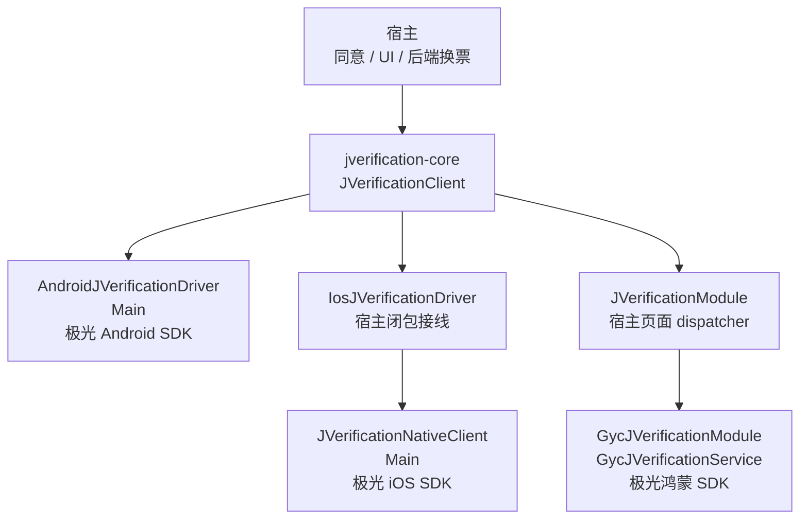
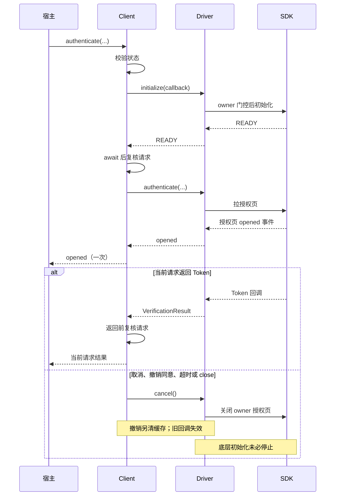
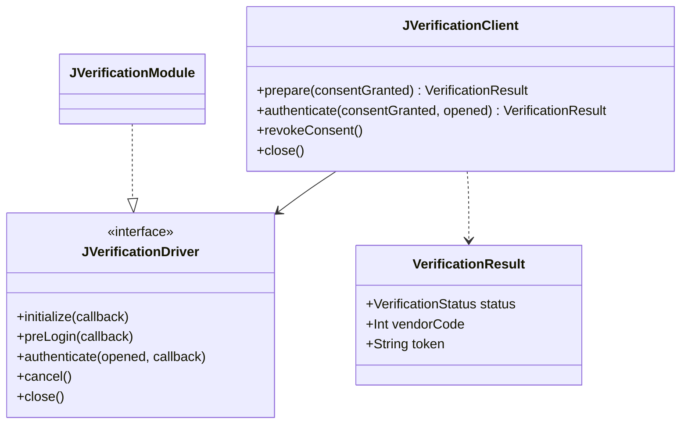

# 极光一键认证组件

封装 Android、iOS、鸿蒙 JVerification 的初始化、预取号、授权 Token 与释放。用户同意、AppKey、应用登记、授权页品牌样式及 Token 后端换票由宿主负责；本库不创建账号、不保存 Token、不输出 SDK content。

Maven `0.1.1` 已发布：[GitHub Release](https://github.com/gycrosskit/jverification/releases/tag/0.1.1)，JitPack 状态 `ok`，独立消费的Android、iOS arm64/x64 编译、iOS Simulator Framework 链接、OHOS 编译通过。 HAR `0.1.0` 已通过 OHPM 审核并上架，正式 Registry 精确版本安装和独立 assembleHar 已通过；GitHub Release HAR 已远程下载、SHA-256 校验、安装到独立工程并 assembleHar 成功。OHPM 不支持此 HAR URL 直接依赖，验收使用下载缓存的 file 依赖，另已使用正式 Registry 版本重新验收安装与编译。

## 目录与平台

| 目录 | 用途 |
| --- | --- |
| `jverification-core/` | KMP 认证 API、同意/超时/取消；Android SDK 驱动、iOS 闭包驱动 |
| `jverification-kuikly/` | 鸿蒙 Kuikly 页面模块；使用宿主页面 dispatcher |
| `iosApp/` | 独立 Swift 原生实现，通过 CocoaPods 引入官方 SDK |
| `ohos/` | 独立原生 HAR 服务与 Kuikly 模块 |
| `verification-consumer/`、`verification-ohos/` | 仅依赖打包产物的独立消费检查 |

Android 最低 API 24，iOS 最低 15.0；HAR 兼容 API 22。Kotlin 使用鸿蒙适配版 `2.2.21-1.0.0`，Kuikly `2.28.0-2.0.21-ohos`。SDK 沿用接入项目版本：Android JVerification `3.4.8` / JCore `5.5.6`，iOS JVerification `3.4.7` / JCore `5.5.1`，鸿蒙 `@jg/verify@1.2.2`。

组件自有源码为 Apache-2.0；厂商 SDK 从 Maven、CocoaPods、ohpm 作为依赖引入，遵循各厂商许可，不复制二进制进 Git。

## 架构与调用流程

KMP client 管理同意、并发与等待；原生适配控制 SDK owner 和授权页，宿主处理 UI 与后端换票。



下面展示 `authenticate(true)` 的正常与取消路径；`prepare` 初始化后只预取号，不打开授权页。





源码：[client、driver 契约与结果](jverification-core/src/commonMain/kotlin/io/github/gycrosskit/jverification/JVerificationClient.kt)、[Android driver](jverification-core/src/androidMain/kotlin/io/github/gycrosskit/jverification/AndroidJVerificationDriver.kt)、[iOS 闭包 driver](jverification-core/src/iosMain/kotlin/io/github/gycrosskit/jverification/IosJVerificationDriver.kt)、[Swift 原生 client](iosApp/Sources/GycJVerificationNative/JVerificationClient.swift)、[Kotlin Kuikly 模块](jverification-kuikly/src/commonMain/kotlin/io/github/gycrosskit/jverification/kuikly/JVerificationModule.kt)、[ArkTS service](ohos/jverification-native/src/main/ets/GycJVerificationService.ets)、[ArkTS 模块](ohos/jverification-native/src/main/ets/GycJVerificationModule.ets)。

Android/iOS 使用 Main，Kuikly client 注入宿主页面 dispatcher；SDK 回调会回到 client dispatcher 结算。各原生适配限制同一进程的 SDK owner，client 和桥均检查请求 generation；`close` 的清理使用 `NonCancellable`，页面销毁仍需关闭 client 和 dispose 模块。组件不保存 Token，也不把取消描述为卸载 SDK；授权、取消和运营商设备验收边界见下文。

## KMP API

```kotlin
val client = JVerificationClient(driver)
val preloaded = client.prepare(consentGranted = hostConsent)
val result = client.authenticate(consentGranted = hostConsent, opened = { hostHideLoading() })
when (result.status) {
    VerificationStatus.TOKEN -> result.token?.let { hostExchangeToken(it) }
    VerificationStatus.CANCELED -> Unit
    else -> hostShowAlternativeLogin(result.status, result.vendorCode)
}
// 撤销同意：取消页面请求并清预取号缓存。
client.revokeConsent()
// 页面销毁前调用；已进入 close 的清理不受调用协程取消影响。
client.close()
```

示例中的 `hostConsent`、后端换票和其他登录提示是宿主逻辑。`VerificationResult.toString()` 不包含 Token；宿主也不得直接记录 `result.token`。

- `prepare(false)` / `authenticate(false)` 不初始化 SDK，并撤销已有请求。
- `prepare(true)` 初始化后只预取号，不拉授权页；认证前不强制预取号成功。
- `opened` 仅在 SDK 授权页打开事件（Android/HarmonyOS `authPageEventListener(2)`、iOS `actionBlock(2)`）后通知一次；在 client dispatcher 执行。调用前、预取号和拉页失败不会通知；通知不结束认证，仍等待 Token、取消或失败。宿主在此撤下 loading，组件不持有宿主 UI 状态。
- 取消、撤销同意、超时、关闭和 Kuikly `dispose()` 后的迟到 opened 无效；SDK 页面关闭事件（1）后也不再接收打开事件。
- 初始化和预取号默认各等待 10 秒；整个授权交互默认最多 120 秒。SDK 拉页/取 Token 超时为 15 秒。交互时间可通过 client 参数调整。
- 同一个 client 的并发请求返回 `BUSY`。原生适配限制同一进程同时只有一个 SDK owner，避免多个页面互相关授权页。
- 取消/撤销/超时使旧回调失效；底层初始化未必可取消，因此不能把页面等待超时当作 SDK 已停止，也不会在 SDK 仍初始化时重复初始化。
- SDK 的具体错误通过 `vendorCode` 保留，业务文案由宿主映射；不返回可能包含凭据的厂商 content。
- 一进程只配置一个 AppKey，所有 SDK 调用通过本组件。厂商 SDK 没有完整卸载 API，撤销同意只能停止本组件的新请求、清缓存和关闭其授权页；不承诺卸载 SDK 或撤回已发送的数据。

### Android

```kotlin
val driver = AndroidJVerificationDriver(
    activity = activity,
    appKey = hostAppKey,
    uiConfig = { hostJVerifyUIConfig() },
    configureBeforeInit = { hostConfigureSdkCollection() },
)
val client = JVerificationClient(driver)
```

Activity、UIConfig、隐私条款和采集开关由宿主注入。构造函数不启动 SDK；各入口在 Main 执行。宿主检查 SDK Manifest 合并、权限、包名、签名、运营商及极光后台配置；组件不替宿主申请与业务无关权限，也不预勾选隐私协议。

### iOS

原生直接使用：

```ruby
# 本地开发；发布后再使用不可变 Git Tag
pod 'GycJVerificationNative', :path => '/Users/guoyang/gycrosskit/jverification'
```

```swift
let native = JVerificationNativeClient(
    appKey: hostKey, production: isProduction,
    presenter: { hostVisibleController() },
    uiConfig: { hostJVUIConfig() }
)
native.prepare(consentGranted: hostConsent) { result in /* 宿主状态 */ }
// 原生直接调用前应先 initialize / prepare，成功后再授权。
native.authenticate(consentGranted: hostConsent, opened: { hostHideLoading() }) { result in
    if result.code == 6000, let token = result.token { hostExchangeToken(token) }
}
native.revokeConsent()
native.close()
```

所有原生调用在主线程。KMP 宿主通过 `IosJVerificationDriver` 的六个闭包连接原生 client；Swift 原生包不依赖某个应用的 `Shared.framework`，可单独消费；已编译的接线示例见 `iosApp/KmpJVerificationBridge.swift`。展示控制器必须已进入可见窗口。没有模拟器或无 SIM 环境的运营商认证保证。

### 鸿蒙

```typescript
const service = new GycJVerificationService(
  context.getApplicationContext(), hostAppKey,
  () => hostUIContext, hostNavPathStack, () => hostJVerifyUIConfig
);
await service.prepare(hostConsent);
const result = await service.authenticate(hostConsent, () => hostHideLoading());
service.close();
```

Kuikly 宿主在原生模块工厂中用该 service 创建 `GycJVerificationModule`，名称与 Kotlin `JVerificationModule.NAME` 相同；Kotlin client 注入宿主页面 dispatcher。桥接的 `{ event: "opened" }` 使用持续回调，终结消息才解绑；宿主消费同一个 client 的 `opened`。销毁页面前关闭 client 并 `module.dispose()`；原生 `onDestroy()` 也释放 SDK owner。AppKey 与 UIContext 从原生工厂注入，不通过 JSON 传品牌对象。

## 发布渠道

| 产物 | 坐标 / 渠道 |
| --- | --- |
| KMP | `com.github.gycrosskit.jverification:jverification-core:0.1.1` |
| Kuikly | `com.github.gycrosskit.jverification:jverification-kuikly:0.1.1` |
| Swift | 根 `GycJVerificationNative.podspec`，Git Tag 消费；未上传 CocoaPods Specs |
| HAR | `@gycrosskit/jverification-native@0.1.0`，OHPM 已上架并完成安装验收 |

全平台 Maven 产物在 macOS 构建，再通过同 Tag 的 GitHub Release 归档供 JitPack 安装，不在仓库自建 Maven。`jitpack-install.sh` / `jitpack-metadata.py` 从组织 `.github/templates/` 同步；metadata 修复限定本库路径。`release-checksums.txt` 没有当前 Tag 的真实 SHA-256 时会在下载前失败，不能填写假校验值。

默认构建使用上表正式坐标。独立消费工程默认从 JitPack 解析；本地验证添加 `-PlocalArtifacts=true` 时只从 `build/maven` 读取本库产物，不依赖源码替换。远程发布后，移除此参数即可验证远程产物。

## 验证

执行入口见 `scripts/verify.sh`。JVM 检查同意门控、只预取号、并发、撤销和迟到 Token、超时、关闭及 Token 输出脱敏，另检查 opened 去重、与终结结果的顺序及取消后的迟到通知；鸿蒙行为替身检查真实 ArkTS 服务与模块相同边界；CocoaPods 验证官方 SDK 的实际编译与链接。验证记录见 `verification/结果.md`。

本地编译/打包不代表已完成真机运营商认证。发布前需用三端登记应用与 SIM 卡验证成功、拒绝、返回、超时、旋转/销毁及撤销同意；核对宿主采集策略、品牌 UI 和后端换票。远程 JitPack 和 GitHub Release HAR 产物消费已通过；OHPM Registry 精确版本安装与编译已通过。

SDK 流程依据：[极光认证流程](https://docs.jiguang.cn/jverification/guideline/jver_process)、[Android API](https://docs.jiguang.cn/jverification/client/android_api)、[iOS API](https://docs.jiguang.cn/jverification/client/ios_api)、[鸿蒙 API](https://docs.jiguang.cn/jverification/client/harmonyos_api)。
